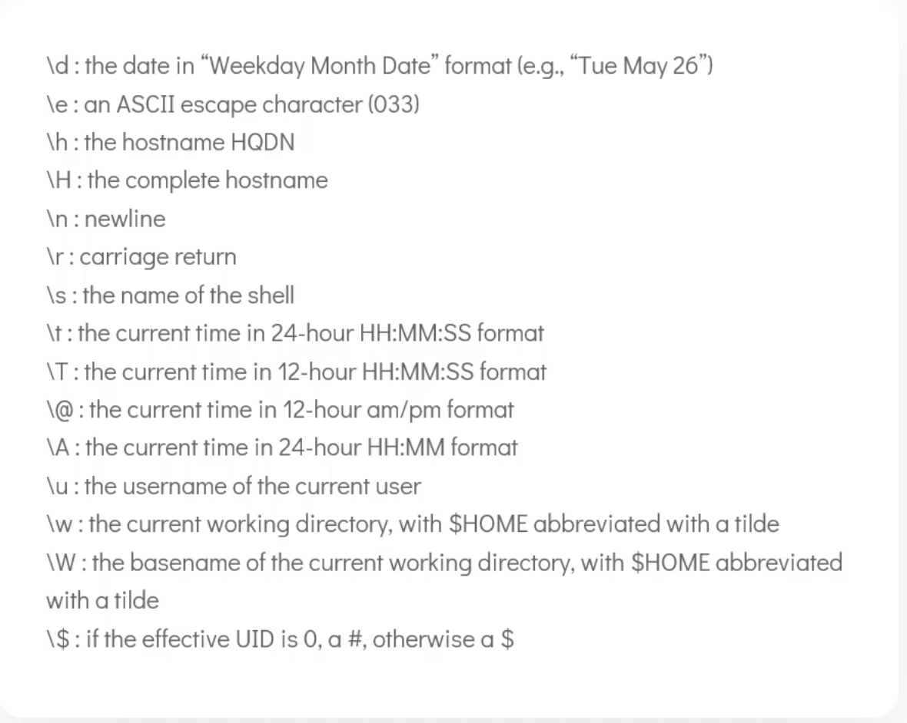

Cat > file.txt — lets you write multiple lines into a file until you hit ctrl +d

Pagers

More , paginates an entire doc - / is used to search

Less, lazy loading pagination

> Whatis - command lol, so I don’t have to ask chat gpt.

> Apropos [keyword] - searches man pages for a keyword

> echo $SHELL — tells you the type of shell , chsh changes the shell kind

> env - lists all the environment variables

> export VAR=value — export sets a variable, if we set without export it only be used in the shell not any other ps
> — to persist env vars we need to add them to ~./profile

> path > the paths to all terminal commands
> which [command] -> lists the path of that command

— sometimes if a program isn’t working we can export to PATH and append a path

> export PATH=$PATH:/opt/obs/bin

— customising PS1 the bash prompt special characters

